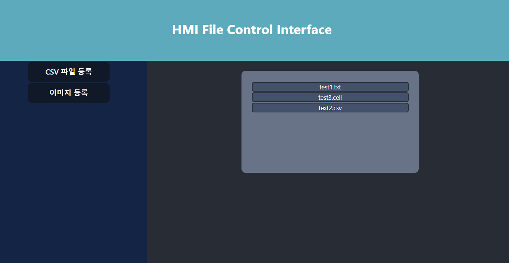

# HMI_Intergace_Step2
Step2 과제

## 설정 정보

### 서버
- 주소: localhost
- 포트: 3000
- CORS 정책: 로컬상의 모든 접속 허용
- 이미지 파일 경로: `./data/img`
- 문서 파일 경로: `./data/doc`

### 제공되는 API
Postman 파일은 `./postman-collection/` 에서 확인 가능

이미지 파일 리스트 GET `http://localhost:3000/getImgFiles`

문서 파일 리스트 GET `http://localhost:3000/getDocFiles`

이미지 파일 POST `http://localhost:3000/uploadImg`, body에 form-data 형식으로 파일 첨부

문서 파일 POST `http://localhost:3000/uploadDoc`, body에 form-data 형식으로 파일 첨부

### 웹 어플리케이션
- 주소: localhost
- 포트: 4000

## 실행 방법

1.  먼저 `./server/` 로 서버 패키지를 설치한 뒤 실행한다.
   - 리포 루트 경로에서 -> `cd server` -> `npm install` -> `npm start`
2. 그 다음 프론트애드 어플리 케이션을 실행한다.
   - 리포 루트 경로에서 -> `cd my-react-app` -> `npm install` -> `npm start`

### 사용법

- CSV 파일 등록 버튼을 누르면 자동으로 문서 파일 리스트를 보여주면서 파일 첨부를 요구한다.
- 이미지 파일 등록 버튼을 누르면 자동으로 이미지 파일 리스트를 보여주면서 파일 첨부를 요구한다.
- 파일 첨부시, 리스트가 자동으로 업데이트 된다.

### 페이지 프리뷰

